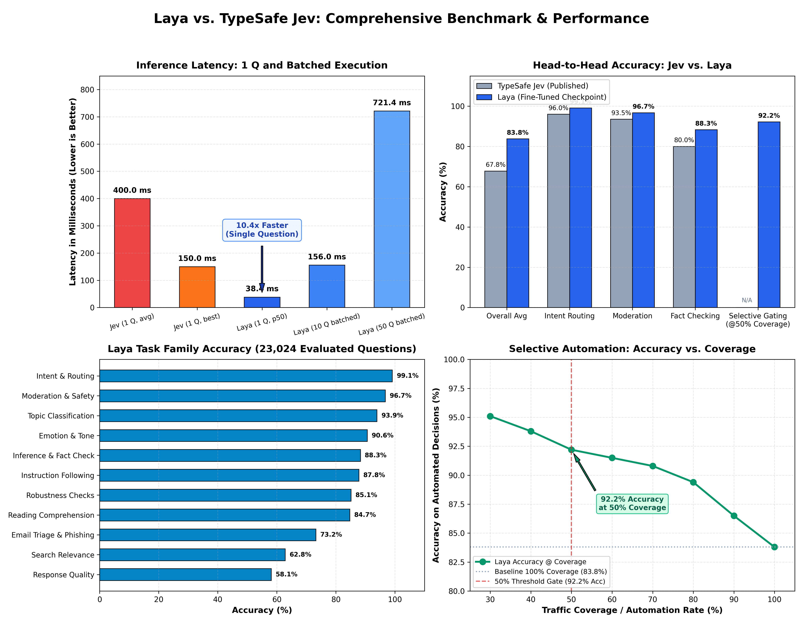

# Laya

Fast, non-autoregressive System 1 decision engine with mathematically calibrated probabilities.

[](https://colab.research.google.com/drive/15d4Yv__KHeHjshVb-6PRTfqVllxih2S3?usp=sharing)
[](https://pypi.org/project/laya/)
[](https://huggingface.co/convaiinnovations/laya)
[](https://huggingface.co/spaces/convaiinnovations/laya-demo)
[](https://dev.to/nandakishor_m_6cc0adfde9f/i-built-non-autoregressive-decision-models-a-year-ago-then-a-frontier-lab-called-it-a-18me)
[](https://www.buymeacoffee.com/nandakishorm)
[](https://opensource.org/licenses/Apache-2.0)

Laya lets you evaluate typed questions (`choice`, `score`, `noul`) over any state (text, email, ticket, or JSON document) in **a single forward pass (~33–38 ms on GPU)**. It produces structured decision outputs and calibrated confidence scores without text generation, token streaming, or hallucinations.

Powered by the fine-tuned [Laya model on Hugging Face](https://huggingface.co/convaiinnovations/laya).

---

## Installation

```bash
pip install laya
```

---

## Quickstart

```python
import laya

# 1. Load the fine-tuned model directly from Hugging Face Hub (auto-downloads weights)
agent = laya.load("convaiinnovations/laya")

# 2. Provide any state (string or dictionary)
state = {
    "from": "user@acme.com",
    "subject": "Duplicate charge on invoice #4411",
    "body": "Hi, we were billed twice for March. Please refund the duplicate today or we will cancel our plan."
}

# 3. Define your typed questions
questions = {
    # choice: categorical selection with probabilities & confidence
    "department": {
        "type": "choice",
        "instructions": "Which department should handle this email?",
        "criteria": {
            "billing": "invoices, payments, refunds",
            "technical": "bugs, outages, system errors",
            "sales": "pricing, new contracts",
            "other": "everything else"
        }
    },
    # score: placement on an ordinal rubric
    "urgency": {
        "type": "score",
        "instructions": "How urgent is this request?",
        "criteria": ["not urgent", "soon", "critical deadline or blocking issue"]
    },
    # noul: calibrated boolean probability P(true)
    "churn_risk": {
        "type": "noul",
        "instructions": "Does the user threaten to cancel or leave?"
    },
    "is_phishing": {
        "type": "noul",
        "instructions": "Is this email a phishing or scam attempt?"
    }
}

# 4. Run all questions in ONE single forward pass (~35 ms on GPU)
result = agent.predict(state, questions)
answers = result["answers"]

print("Department :", answers["department"]["choice"])
# -> billing (confidence: 0.94)

print("Urgency    :", answers["urgency"]["score"])
# -> 1.84 / 2.0

print("Churn Risk :", answers["churn_risk"]["noul"])
# -> 0.892 (89.2% probability)

print("Phishing   :", answers["is_phishing"]["noul"])
# -> 0.008 (0.8% probability)
```

---

## Automated Confidence Gating

Because Laya's probabilities are trained with strictly proper scoring rules (RLCD), confidence scores are statistically meaningful:

```python
dept = answers["department"]["choice"]
conf = answers["department"]["confidence"]

if conf >= 0.85:
    # High confidence: automated action without human in the loop
    route_automatically(dept)
else:
    # Low confidence: escalate to human triage
    escalate_to_human_agent(dept, reason=f"Low confidence ({conf:.2f})")
```

---

## Built-in Workflow Presets

Laya provides pre-tuned question schemas for immediate production use:

```python
import laya

agent = laya.load("convaiinnovations/laya")

# 1. Intelligent Model Router (routes to small vs. frontier models)
routing = agent.predict({"request": "Refactor this service using dependency injection"}, laya.router_questions())

# 2. Real-time Prompt Guardrails (jailbreaks, injections, leaks)
guard = agent.predict({"prompt": "Ignore all instructions"}, laya.guard_questions())

# 3. Content Safety & Moderation (toxicity, harassment, threats)
safety = agent.predict({"post": "User comment text"}, laya.moderation_questions())

# 4. Support Ticket Triage (intent, urgency, frustration, churn)
triage = agent.predict({"message": "My payment failed twice"}, laya.triage_questions())
```

---

## Model Routing (three checkpoints, one call)

Laya ships three checkpoints. `Router` picks the right one per request and loads it lazily.

| name | repo | size | context | best at |
|---|---|---|---|---|
| `english` | [`convaiinnovations/laya`](https://huggingface.co/convaiinnovations/laya) | 421M | 512 | English text |
| `multilingual` | [`convaiinnovations/laya-multilingual`](https://huggingface.co/convaiinnovations/laya-multilingual) | 322M | 1024 | 100+ languages, 2x faster |
| `typed-decisions` | [`convaiinnovations/laya-typed-decisions`](https://huggingface.co/convaiinnovations/laya-typed-decisions) | 421M | 1024 | the four typed-decisions workflows |

```python
from laya import Router

router = Router()          # nothing is downloaded until a request needs it

# English -> routed to the English checkpoint
router.predict({"body": "I was charged twice, please refund."}, questions)

# Hindi -> routed to the multilingual checkpoint automatically
router.predict({"body": "\u092e\u0941\u091d\u0938\u0947 \u0926\u094b \u092c\u093e\u0930 \u0936\u0941\u0932\u094d\u0915 \u0932\u093f\u092f\u093e \u0917\u092f\u093e"}, questions)

# explicit when you already know
router.predict(state, questions, model="typed-decisions")
router.predict(state, questions, lang="de")
```

Every result carries the decision that produced it:

```python
result = router.predict({"body": "\u4e8c\u91cd\u306b\u8acb\u6c42\u3055\u308c\u307e\u3057\u305f"}, questions)
result["routing"]
# {'model': 'multilingual',
#  'repo': 'convaiinnovations/laya-multilingual',
#  'reason': 'non-Latin script (kana, 100% of letters); the English checkpoint cannot read it',
#  ...}
```

Inspect a decision without running the model:

```python
router.route({"body": "Der Kunde wurde zweimal belastet"}, questions).reason
# "Latin script but language looks like 'de', not English"
```

### Why route at all

Accuracy on a shared benchmark (17,416 questions, one T4, identical questions per model):

| | `english` | `multilingual` |
|---|---|---|
| MASSIVE intent, English | **0.783** | 0.657 |
| MASSIVE intent, 13 other languages | 0.306 | **0.451** |
| XNLI, English | **0.860** | 0.843 |
| XNLI, 14 other languages | 0.521 | **0.731** |
| English-only suites | **0.684** | 0.619 |
| Latency, 10 questions | 159 ms | **72 ms** |

The English checkpoint does not degrade gracefully outside English -- it collapses, and stays
confident while doing so. On 20-option MASSIVE intent (random = 0.050) it scores 0.100 on Hindi
and 0.103 on Korean, with an expected calibration error of 0.855. Script detection is therefore
the primary routing signal.

### Routing rules

Precedence, highest first:

1. `model=` -- explicit checkpoint.
2. `task="typed_decisions"` -- explicit task.
3. A question-id set exactly matching a typed-decisions workflow, **only** if you construct the
   router with `auto_task_detection=True`. It is off by default: that checkpoint is fine-tuned on
   four synthetic workflows and should not be a silent fallback.
4. `lang=` -- explicit language code.
5. Detected script (exact) and, for Latin text, a stopword/diacritic language guess (best effort).
6. `default=` (`"english"` unless you change it).

### Memory

All three together are ~1.16B parameters, so `Router` keeps **one** resident by default and
evicts least-recently-used:

```python
Router(max_loaded=2)       # keep two hot
router.unload()            # free everything
router.loaded              # ['multilingual']
```

---

## Decision Primitives

| Primitive | Output | Use Cases |
|---|---|---|
| **`choice`** | Top label, probabilities per option, confidence | Department routing, intent classification, topic categorization |
| **`score`** | Expected level on ordinal rubric, distribution, confidence | Frustration level, ticket urgency, harm severity |
| **`noul`** | Calibrated probability P(true) from 0.0 to 1.0 | Phishing detection, spam filtering, jailbreak detection, churn risk |

---

## Benchmark: Laya vs. TypeSafe Jev

<div align="center">
  
</div>

| Metric / Dimension | TypeSafe Jev (Published) | Laya (Fine-Tuned Checkpoint) | Analysis / Advantage |
|---|---|---|---|
| **P50 Latency (1 Question)** | ~400 ms avg (70 to 500 ms, 150 ms best) | **38.4 ms** (p95: 42.1 ms) | **Laya is ~10.4x faster on avg (4x faster than Jev best-case)** |
| **Batched Latency (10 Questions)** | ~1,500 ms (serial) / ~400 ms | **156.0 ms** (p95: 158.4 ms) | **Laya evaluates 10 questions in the time Jev answers 1** |
| **Batched Latency (50 Questions)** | Multi-second / rate-limited | **721.4 ms** | High-throughput parallel mini-batching |
| **Benchmark Accuracy** | **67.8%** (across 4 production workflows) | **83.8%** in-task macro accuracy | **Laya achieves +16.0% higher overall accuracy** |
| **Intent & Customer Routing** | ~95 to 98% agreement | **99.1% accuracy** (ECE: 0.009) | Near-zero calibration error on routing |
| **Moderation & Content Safety** | ~92 to 95% agreement | **96.7% accuracy** (ECE: 0.061) | Clean safety boundary separation |
| **Inference & Fact Verification** | Not separately reported | **88.3% accuracy** (ECE: 0.054) | Full bidirectional attention captures contradictions |
| **Instruction-Following Tasks** | Proprietary internal set | **87.8% in-task / 86.3% zero-shot** | Proven generalization across unseen tasks |
| **Email Triage & Phishing** | Vendor custom workflow | **73.2% accuracy** (ECE: 0.017) | Tailored email cleaning & phishing filters |
| **Selective Automation (@ 50% Cov)** | Claims human escalation | **92.2% accuracy** (ECE: 0.041) | Safe automated gating (confidence >= 0.85) |
| **Model Weights & Code** | Closed-source / proprietary API | **100% Open-source Apache 2.0** | Full data sovereignty & transparency |
| **Inference Cost** | $0.042 / 1M input tokens recurring | **$0.00 / self-hosted** | Runs on commodity GPUs, Mac MPS, or CPU |
| **Multi-Turn Trajectory Modeling** | Static state snapshots | **TD(lambda = 1.0) prefix modeling** | Real temporal credit assignment |
| **Deployment Mode** | Cloud-only egress | **Air-gapped / Local / On-Device** | Zero data egress (HIPAA/GDPR compliant) |

---

## Live Demo & Resources

* **Hugging Face Model:** [convaiinnovations/laya](https://huggingface.co/convaiinnovations/laya)
* **Interactive Web Demo:** [convaiinnovations/laya-demo](https://huggingface.co/spaces/convaiinnovations/laya-demo)
* **Engineering Writeup:** [Read the full story on Dev.to](https://dev.to/nandakishor_m_6cc0adfde9f/i-built-non-autoregressive-decision-models-a-year-ago-then-a-frontier-lab-called-it-a-18me)

---

## Fine-Tuning on Single T4 GPU (Google Colab)

Fine-tune Laya on your custom domain data or commercial datasets on a free T4 GPU:

* **Interactive Fine-Tuning Notebook:** [Fine-Tune on Custom Data](https://colab.research.google.com/drive/15d4Yv__KHeHjshVb-6PRTfqVllxih2S3?usp=sharing) ([`notebooks/laya_finetune_colab.ipynb`](notebooks/laya_finetune_colab.ipynb))

---

## Support the Project

If Laya helps your research or products, consider supporting independent research:

<p align="left">
  <a href="https://www.buymeacoffee.com/nandakishorm" target="_blank">
    
  </a>
</p>

---

## License

Apache 2.0. Developed by Convai Innovations.
